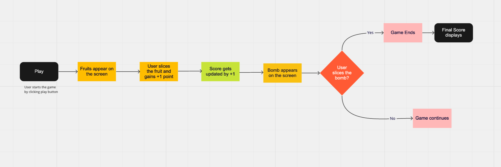

# 🍉fruit-ninja

Fruit ninja game that you can play on your computer. 
The goal of the game is to slice as many fruits as one can while avoiding slicing bombs.

### 🧭 Rules/How to play:

<li>Single-player game.</li>
<li>Slicing 1 fruit accounts for 1 point</li>
<li>Slicing 3 fruits simultaneously will account for (3\*10 =30 points)- Nice to have feature.</li>
<li>Slicing the bomb/s will end the game.</li>

### 💡Features:

<li>AJAX to update the scores on the screen as the user's score increases.</li>
<li>Sound effects.</li>
<li>fruits appearing on the screen.</li>
<li>Slicing fruit by mouse action.</li>

### ⚙️ MVP:

<li>fruit appears on the screen one by one</li>
<li>bomb appears after an interval</li>
<li>current scores updates with every fruit sliced</li>
<li>the game ends if the bomb is sliced.</li>

### 🍒 Nice to have:

<li>fruits and bombs appear simultaneously.</li>
<li>When fruit is sliced, it opens up in two halves.</li>
<li>Cut fruit splashes on the background wall.</li>
<li>user login to store the score for them to come back and start from the previous score.</li>

## 👥 User Flow:

<li>No user login/registration required to play the game</li>

